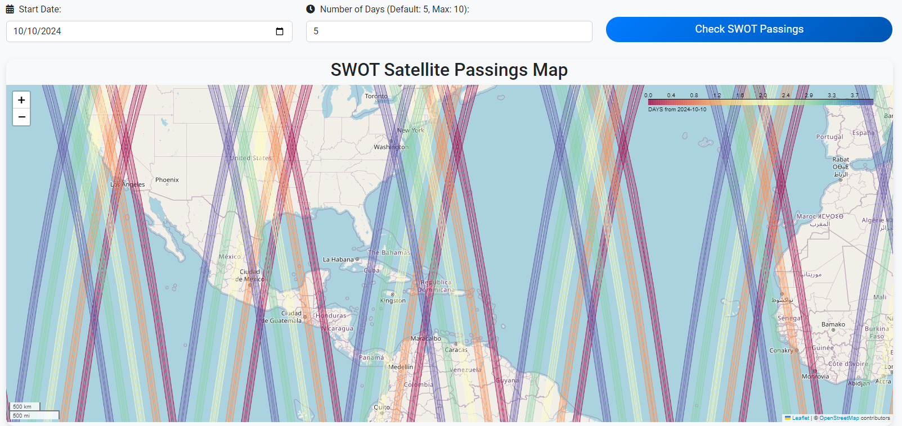

# Where is SWOT?

**Where is SWOT?** is a web application that allows users to visualize and track the passings of the **Surface Water and Ocean Topography (SWOT)** satellite as it orbits the Earth. By selecting a date range and the number of days, users can generate a map showing the satellite's projected path, helping researchers, scientists, and water management organizations predict when and where SWOT will collect fresh data. Check it [here](https://whereisswot.onrender.com/)!

[](https://doi.org/10.5281/zenodo.13916363)



## Table of Contents
- [Overview](#overview)
- [Why This Tool is Useful](#why-this-tool-is-useful)
- [Features](#features)
- [Technologies Used](#technologies-used)
- [Usage](#usage)
- [Contributing](#contributing)
- [License](#license)

## Overview

The **Where is SWOT?** tool is designed to help users monitor and track the SWOT satellite’s orbit and predict data collection points across the globe. This tool is particularly useful for researchers and scientists studying Earth's surface water and ocean topography.

## Why This Tool is Useful

The SWOT satellite provides high-resolution data critical for studying **climate change**, **water resources**, and **ocean dynamics**. This web application allows users to:
- Visualize the SWOT satellite’s orbit over time.
- Monitor the satellite’s data collection in specific regions.
- Anticipate future satellite passings and plan fieldwork accordingly.

## Features

- **Date Range Selection**: Users can select a specific start date and specify a number of days (up to 10) to track the satellite's path.
- **Interactive Map**: The app generates a map showing the SWOT satellite's projected orbit and data collection points.
- **Loading Spinner**: Provides feedback to users when the map is being generated.
- **Responsive Design**: The web app is optimized for desktop and mobile devices.

## Technologies Used

- **Python**: Flask as the backend web framework.
- **HTML/CSS**: For front-end structure and styling, using Bootstrap for responsive design.
- **JavaScript**: For interactivity (loading spinner, map integration).
- **Folium/GeoPandas**: To generate and render the map with satellite passings.
- **FontAwesome**: For icons in the user interface.
- **Google Fonts**: For modern typography.

## Usage

Once the app is running, follow these steps to use the **Where is SWOT?** tool:

1. **Select a Start Date**: Choose a start date for the satellite tracking.
2. **Choose the Number of Days**: Select the number of days you want to track (up to 10).
3. **Click "Check SWOT Passings"**: The app will generate a map showing the satellite’s passings for the selected date range.
4. **View Results**: The map will display the projected path of the SWOT satellite, highlighting its coverage areas.

## Contributing

Contributions are welcome! If you'd like to improve this project, follow these steps:

1. **Fork the Repository**
2. **Create a New Branch**
   ```bash
   git checkout -b feature/new-feature
   ```
3. **Make Your Changes**
4. **Commit and Push Your Changes**
   ```bash
   git commit -m "Add new feature"
   git push origin feature/new-feature
   ```
5. **Create a Pull Request**: Submit your changes for review.

## License

This project is licensed under the MIT License. See the `LICENSE` file for details.
